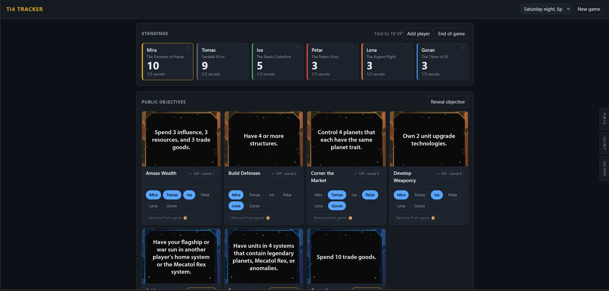
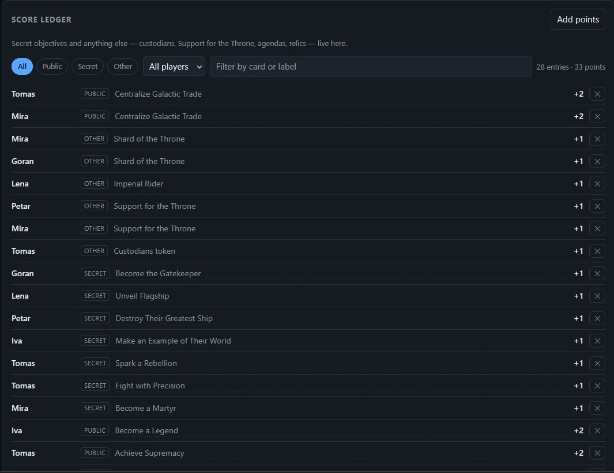
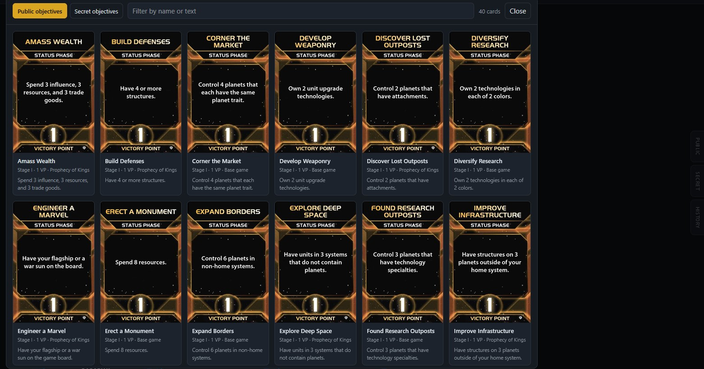

# TI4 Objective Tracker

A small scoring aid for Twilight Imperium 4th Edition purely for personal use. 
Runs a local web server on the game PC; anyone at the table can open it on a 
phone or tablet on the same Wi-Fi.

## What it does

- Mark which public objectives are revealed this game (Stage I / Stage II)
- Tap a player against a revealed objective to score it
- Add ad-hoc points with a label, for secret objectives and everything else
- Live running totals per player, with a leader highlight
- Filter the ledger by player, by kind, or by card name
- **End of game** prints a standings sheet: totals split by where the points
  came from, saved as a PDF through the browser's own print dialog

## Stack

| Piece | Choice |
|---|---|
| Framework | Spring Boot 4.1.1 |
| Java | 21 (Adoptium, via `JAVA_HOME`) |
| Build | Maven |
| Database | SQLite, single file at `data/ti4.db` |
| Data access | `spring-boot-starter-jdbc` + `JdbcClient` |
| Front end | Plain HTML/CSS/JS, no framework |

## Design decisions

**Spring Boot 4.1**  4.1 covers Java 17–26 and 21 was my weapon of choice

**JDBC, not JPA.** `JdbcClient` plus an explicit `schema.sql` keeps the
SQL visible and avoids the dialect problem entirely as I don't think that Hibernate
supports SQLite's dialect outside some odd community versions

**Connection pool of one.** SQLite serialises writers. With several people
tapping at once, a bigger pool produces `SQLITE_BUSY` errors rather than
throughput, so `spring.datasource.hikari.maximum-pool-size=1`. 

**JDK 21 pinned explicitly.** My machine has Adoptium JDK 21 at `JAVA_HOME`. 
The build uses `JAVA_HOME` so there is no ambiguity, and no need to change 
system environment variables.

**Requests are form-encoded, responses are JSON.** Form encoding needs no
request DTO per endpoint as the app is fairly small.

**Points are an append-only ledger.** The `score` table holds one row per
scoring event, not a running total. A player's score is a `SUM` over their rows,
so every point is attributable and any mistake is fixed by deleting one row
rather than reverse-engineering a total. Gives me a better option if someone
enters something wrong, then it's just that row that goes and the recalculation
picks up the changes

**Objectives are data, not code** — see `data/objectives-seed.csv`. Fixing a
wrong requirement or adding a homebrew card is a one-line edit, no recompile.
Massive room for homebrewers, will do more on this when I check what the 
community has cooked up and what looks table-ready.
The seeder only runs when the table is empty, so it never clobbers cards
added in the app.

## Objective data accuracy

`data/objectives-seed.csv` carries base-game and Prophecy of Kings objectives

**Thunder's Edge added no new public objectives** so the 40 base + PoK cards are 
the complete set. Factions themselves are pretty much the only thing I put inside

**Reveal objective → Card not listed…** stays available for homebrew cards, and
is also how I can attach an image to a card that has none.

## Card images

Drop card scans in `data/images/` and put the filename in the objective's `image`
field. They are served straight off disk, so a new image needs no rebuild.

The artwork on all cards is Fantasy Flight Games' copyright, and
a public GitHub repo is a different proposition from a folder on your own
machine. `.gitignore` keeps them local due to possible legal issues regarding
copyright laws.

So a fresh clone has no scans. Cards fall back to their text layout and the
gallery shows "no scan yet" -- the app is built to degrade that way rather than
break. The screenshots at the top are the only place this repo shows what it
looks like with the art in place.

## Running it

Easiest is the green run arrow on `Ti4TrackerApplication` in IntelliJ, or the
Maven panel's `spring-boot:run`.

On startup it logs both addresses -- the local one and the LAN one the phones
need -- so there is nothing to look up:

```
TI4 tracker is ready.
  On this PC:      http://localhost:8080
  At the table:    http://192.168.1.42:8080
```

IntelliJ turns those into clickable links in the console. Windows Firewall may
need to allow inbound 8080 the first time another device connects.

From a fresh clone, with no Maven installed:

```bash
./mvnw spring-boot:run       # macOS, Linux, Git Bash
mvnw.cmd spring-boot:run     # Windows cmd or PowerShell
```

The wrapper fetches Maven itself on first run, so a JDK 21 or newer is the only
prerequisite. Start it from the project root: `data/ti4.db` is a relative path,
so launching from elsewhere quietly creates an empty database next to wherever
you started instead of opening the real one.

## Layout

```
ti4-tracker/
  pom.xml
  data/
    objectives-seed.csv        the card catalogue -- edit freely
    ti4.db                     live database (not committed)
    images/                    your card scans (not committed)
  src/main/java/ti4/
    Ti4TrackerApplication.java
    Ti4Properties.java         externalised paths
    WebConfig.java             serves /images/** off disk
    ObjectiveSeeder.java        CSV import on first boot
    domain/                    records
    repo/                      JdbcClient queries
    web/ApiController.java     the whole API
  src/main/resources/
    application.properties
    schema.sql
    static/                    index.html, style.css, app.js
```

## API

Responses are JSON. Request bodies are `application/x-www-form-urlencoded`.

| Method | Path | Purpose |
|---|---|---|
| `GET` | `/api/state?game=<id>` | Everything the UI needs in one call |
| `GET` | `/api/games` | List saved games |
| `POST` | `/api/games` | New game — `name`, `vpTarget`, `maxSecrets` |
| `GET` | `/api/objectives` | Catalogue, optional `expansion` filter |
| `POST` | `/api/objectives` | Add a card |
| `POST` | `/api/objectives/image` | Attach a scan — `id`, `image` |
| `POST` | `/api/players` | Add player — `gameId`, `name`, `faction`, `color` |
| `DELETE` | `/api/players` | Remove player — `id` |
| `POST` | `/api/reveal` | Reveal — `gameId`, `objectiveId`, `round` |
| `POST` | `/api/unreveal` | Un-reveal, and delete its scores |
| `POST` | `/api/score` | Toggle a player on a public objective |
| `POST` | `/api/points` | Manual entry — `points`, `label`, `kind` |
| `POST` | `/api/points/delete` | Remove a ledger row — `id` |
| `GET` | `/api/factions` | Faction list for the add-player dropdown |
| `GET` | `/api/point-sources` | Label options, seeded plus learned from use |
| `GET` | `/api/standings?game=<id>` | End-of-game report, read-only |
| `GET` | `/api/audit` | History — optional `game`, `limit` (default 300, max 2000) |

## History

Every mutating action is recorded in the `audit` table and shown under the
**History** edge tab: game and player creation, reveals, scoring and un-scoring,
manual points, and every removal. Removals are highlighted, since "who deleted
that" is the question the log exists to answer.

The table is deliberately **not** foreign-keyed to `game` or `player`. The whole
point is that the record outlives the row it describes — a cascade would delete
the evidence along with the player.

There is no login, so the recorded actor is the requesting device's address.
Requests from the game PC show as "game PC"; anything else shows its LAN
address, which is what distinguishes one phone at the table from another.

Audit writes never throw: losing a history line is bad, losing someone's score
because the history write failed would be worse. Lines also go to the
application log, so the trail survives the database file being replaced.


## End-of-game report

**End of game** opens the standings as a printable sheet. It is **read-only** —
it reports the game, it does not end it — so it can also be opened mid-game as a
scoreboard without any "are you sure" weight.

Each total is split into public objectives, secret objectives, and **one column
per other source that was actually scored**. A source nobody claimed is absent
entirely: no empty Shard of the Throne column on the page. Columns appear in the
order the sources were first scored, and ×n next to a number is how many cards
or events are behind it.

The numbers come from the same ledger the screen renders, via
`GET /api/standings`, so the report and the running totals cannot drift apart.

**PDF** is the browser's own print-to-PDF rather than a library on the server.
It writes a real PDF on every device at the table, needs no dependency, and is
the one place the page's own layout is guaranteed to survive. The sheet is copied
into a hidden `#printRoot` first and the print stylesheet hides everything else,
which keeps a modal `<dialog>` — whose printing behaviour differs by engine —
out of the output. Wide reports switch to landscape, and the document title is
set so Chrome names the saved file after the game.

## Scoring rules encoded

- Public objectives: Stage I = 1 VP, Stage II = 2 VP, taken from the card
- Secret objectives: entered manually, since they are hidden information(always 1 VP)
- The secret cap (3, or 4 with The Obsidian) is a **warning, not a block** — the
  app should never refuse input mid-game and leave you arguing with it
- Other VP sources — custodians token, Support for the Throne, Imperial, agenda
  outcomes like Shard of the Throne, relics like the Crown of Emphidia — go
  through the same manual entry with a label

## Testing

```bash
./mvnw test
```

22 tests, in two layers.

`StandingsCalculatorTest` covers the end-of-game arithmetic with no Spring and
no database. The calculation was pulled out of the controller into
`StandingsCalculator` for exactly this reason: everything it needs is passed in,
including the timestamp, so the rules that are easy to get wrong and impossible
to spot going wrong at the table can be asserted directly. A column for a source
nobody scored, a tie quietly resolved in favour of whoever was added first, a
total that stops matching the parts it is made of.

`ScoringApiTest` drives the real API against a throwaway SQLite file in a temp
directory, asserting on the JSON rather than on deserialised objects -- the JSON
is the contract the browser consumes, and a field quietly renamed would break it
while a Java-side assertion still passed. Only the datasource URL is overridden,
so the schema, the CSV seeding and the foreign-key PRAGMA are the application's
own configuration and under test too.

That last one matters more than it looks. SQLite defaults `foreign_keys` to OFF
per connection, which would make every `ON DELETE CASCADE` in `schema.sql`
decorative. The cascade test was checked by turning the PRAGMA off and
confirming it fails -- with it off, a removed player's score rows survive as
orphans and the ledger still counts them. A test guarding a silent failure is
worth nothing until you have watched it fail.

Each test makes its own game. Games are independent, so that is enough isolation
without truncating tables in between.

Not covered: the front end. `app.js` is verified by hand.

## Screenshots

The board mid-game. Standings across the top with the leader highlighted, then
every revealed public objective with its requirement text and a chip per player:



The score ledger, filterable by player, by kind, or by card name. Every point in
the game is one row here, so a total is a SUM and a mistake is one deletion:



The card gallery, for looking a card up without reaching across the table:

